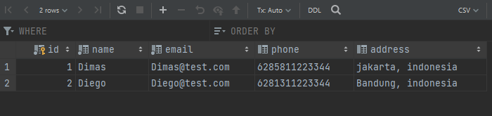
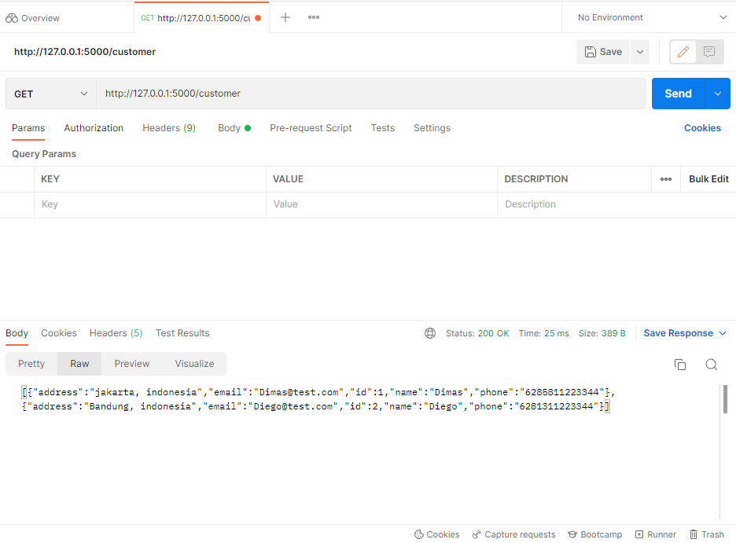
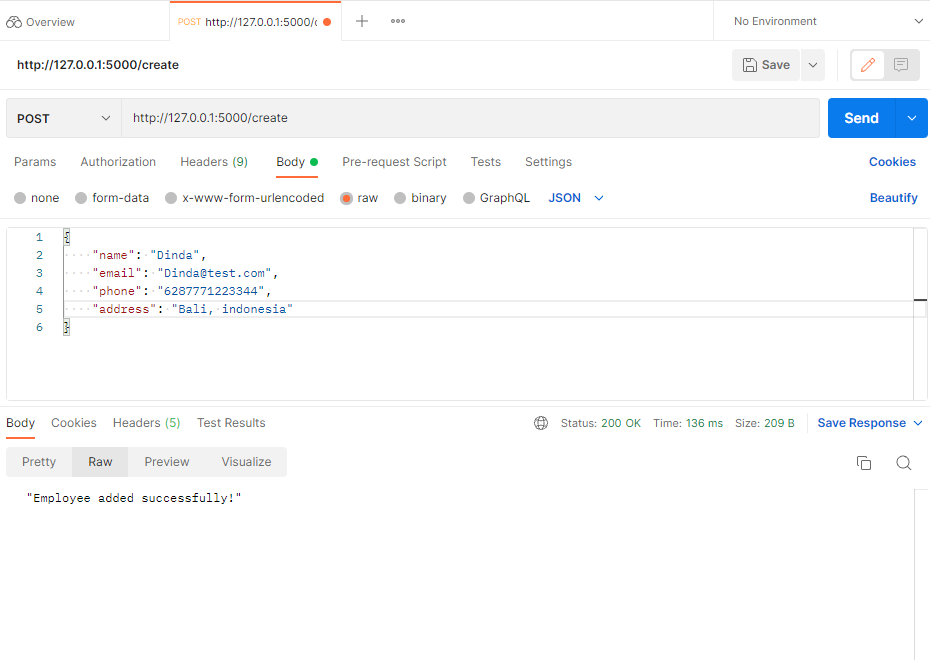
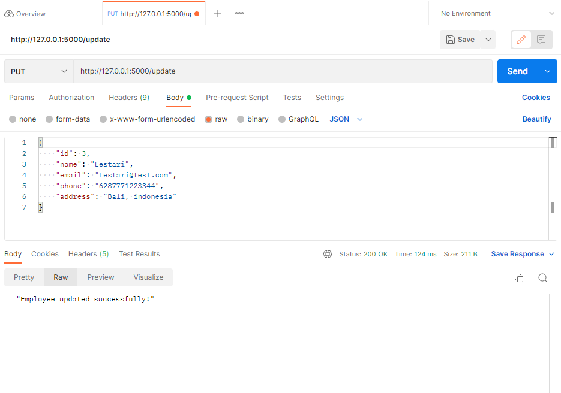

#  RESTful API - CRUD Data using Python and mysql
### RESTful API GET, POST, PUT, DELETE using Python with CRUD Mysql with Postman Test

# SQL

# Get -> Read Data

# Post -> Create Data

# Put -> Update

# Delete

